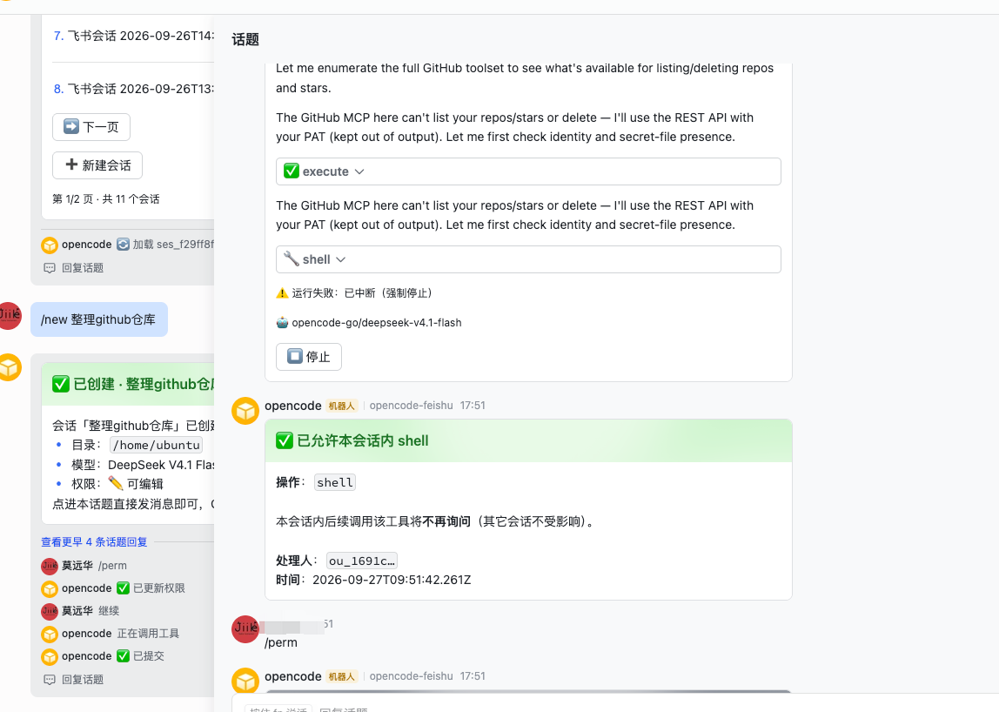
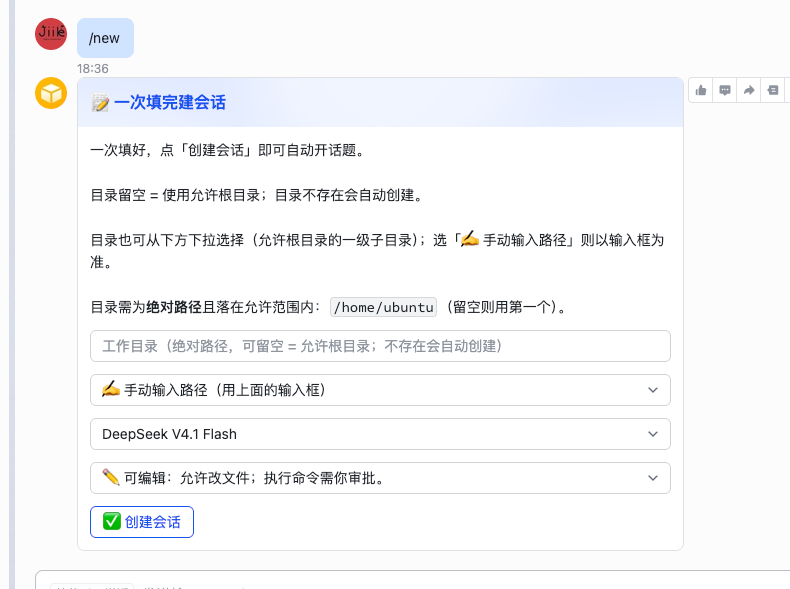
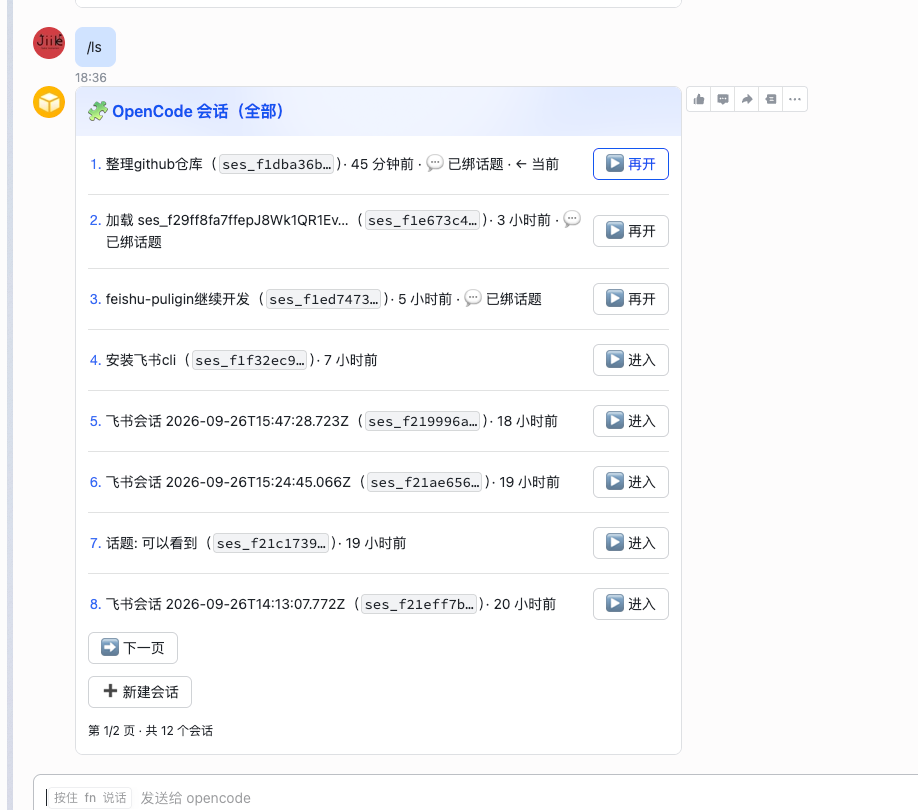
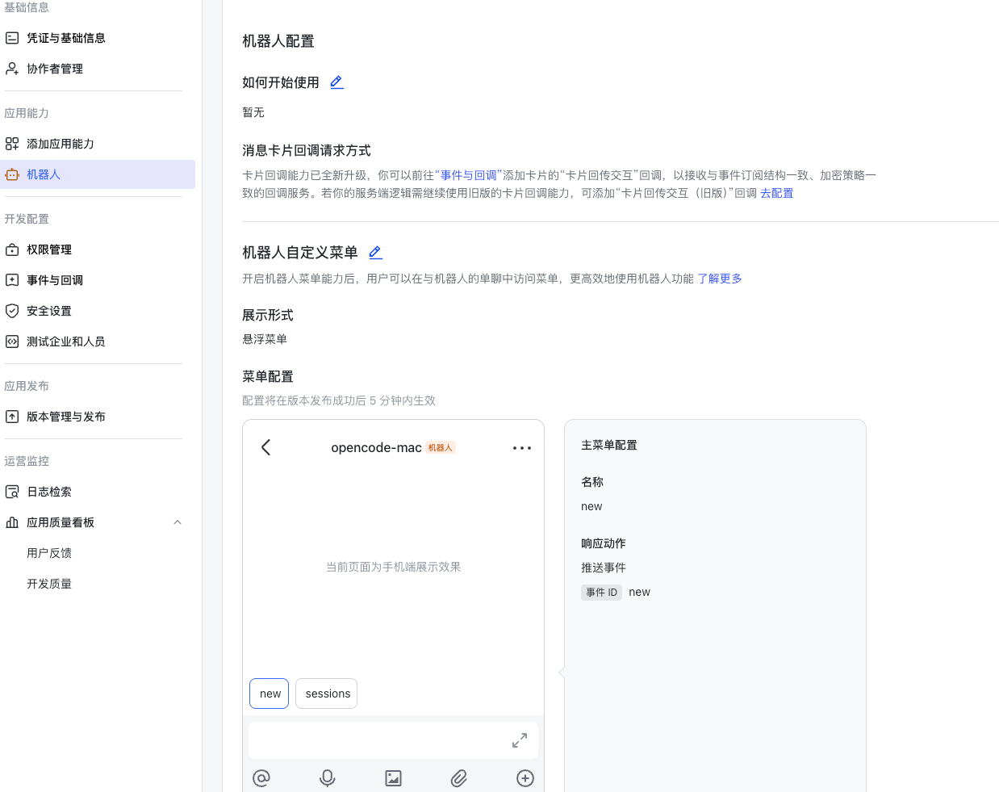

# opencode-feishu-plugin

**English** | [简体中文](./README.md)

Connect [OpenCode](https://opencode.ai) to Feishu/Lark: **one Feishu topic = one OpenCode session**, and permission approvals happen right on Feishu cards.

- OpenCode **V2 only** (`@opencode/plugin`, `Plugin.define`); no V1 packages.
- **Pure long connection** (WebSocket) for events and card callbacks: no port listening, no public endpoint.

## Preview



## Highlights

| | Description |
|---|---|
| 🔐 **Minimal permission** | Only 2 scopes; no group permission is requested, so the bot physically cannot receive group messages |
| 💬 **Topic = session** | Each Feishu topic maps to one OpenCode session; the main chat is console-only |
| 🚀 **One-shot session** | `/new` opens a single form (directory + model + permission preset); submit to create a session and auto-open a topic |
| ✅ **Card approvals** | Permission requests become cards: allow once / always / this session only / deny — signed tokens prevent forgery and replay |
| 📊 **Real-time visible** | "Thinking" receipt → live tool-call cards → streaming text updates; footer shows the current model |
| ⏹ **Controllable** | Every reply card has a "force stop" button; a watchdog auto-interrupts stuck sessions; new messages **cut in by default** when busy (configurable to queue), `/steer` `/now` always available |
| 📎 **Images / files** | Images and files sent in Feishu are downloaded and attached to the session, so vision/file-capable models can see and read them |
| 🧭 **One-sentence session** | Send a task in the main chat — the AI judges intent, finds the right working directory, and creates + starts the session in one tap |
| 🖱 **Main-window menu** | Two fixed quick buttons above the chat input — "New session" and "Session list" (bot custom menu) — one tap to fire them |
| 🚫 **No ports** | Full long-connection; no inbound port needed on the server |

## 1. Feishu app setup (~3 minutes)

1. Open the [Feishu Open Platform](https://open.feishu.cn/app) → **Create an enterprise self-built app**.
2. **Add app capability → Bot**.
3. **Permission management → API permissions**: enable these two **required** scopes first:
   - `im:message.p2p_msg:readonly` — read messages users send to the bot in p2p chat
   - `im:message:send_as_bot` — send messages as the app (also used to update cards)

   **To receive images / files, add one more** (skip if you don't need it):
   - `im:message:readonly` — fetch message resources (**required** to download images / files)

   > ⚠️ Without `im:message:readonly`: images/files are **not downloaded** — the message still reaches the AI, but with placeholder text ("…download failed…"). After enabling it, **re-create and publish an app version** for it to take effect.
4. **Events & Callbacks → Event configuration**: subscription method **"Use long connection to receive events"** (do **not** pick Webhook), add event `im.message.receive_v1`.
5. **Events & Callbacks → Callback configuration**: same long-connection method, add callback `card.action.trigger` (zero permission requirement).
6. **Bot menu (optional, recommended)**: **App capabilities → Bot → Bot custom menu** — enable the menu, pick the **floating menu** style, and add two items (any name/icon, **action = push event**):
   - "➕ New session" → `event_key` = `new`
   - "📋 Session list" → `event_key` = `sessions`
   Then add the event `application.bot.menu_v6` under **Event configuration** (zero permission requirement). Result: two quick buttons above the chat input that act like sending `/new` / `/sessions`.
7. **Version management & release**: availability = **only yourself**, create a version and **publish**. ⚠️ Without publishing the app stays in "development" state and the long connection cannot connect — the bot will never respond.
8. Note down the **App ID** (`cli_…`) and **App Secret**.

> **Why no group permission?** This plugin is a "single-user remote control". Without group permission the bot **physically cannot receive group messages** — the single-user boundary is guaranteed by the platform scope layer, not only by code.

## 2. Installation

### 2.1 Install the plugin

```bash
# Option A — CLI (recommended)
opencode plugin add opencode-feishu-plugin
```

```jsonc
// Option B — write config manually (APPEND to the existing plugins array, don't overwrite the file)
{ "plugins": ["opencode-feishu-plugin"] }
```

The entrypoint is a **self-contained** `dist/index.js` (Feishu SDK bundled); no manual `npm install` needed at runtime.

### 2.2 Configuration

Create `~/.config/opencode/plugins/feishu.json` (`configDir` = `OPENCODE_CONFIG_DIR` or `~/.config/opencode`):

```bash
install -m 600 /dev/null ~/.config/opencode/plugins/feishu.json
cat > ~/.config/opencode/plugins/feishu.json <<'JSON'
{
  "appId": "cli_xxxxxxxx",
  "appSecret": "xxxxxxxx",
  "logFile": true
}
JSON
```

- Credential **priority**: `plugins[].options` > `feishu.json` > environment variables. You may also use `{env:NAME}` / `${NAME}` placeholders in values to pull from env.
- **We recommend `logFile: true`**: stderr is discarded in server mode; the log file is your only window into plugin behavior.

### 2.3 Activate & verify

```bash
opencode reload
tail -f ~/.config/opencode/plugins/feishu.log   # you should see "飞书长连接已启动（WSClient）"
```

Then send a message to the bot in Feishu. **The first person to message is auto-bound as owner** — a card reply means installation succeeded; everyone else is silently ignored.

> After upgrading the plugin or switching to a global plugin directory, run `opencode service restart` so it re-imports.

## 3. Quick start

### Main chat (console)

The main chat **only manages**; plain text never enters any session.

| Command | Effect |
|---|---|
| `/new [title]` | Send a session-create form; submit to create a session and auto-open a topic (same as `/form`) |
| `/sessions` (`/ls`) | **All** sessions list (including every local opencode session); paginate, enter, create |
| `/resume [index]` | Send a resume card for the most recent (or Nth) session; **reply to the card** to continue |
| `/current`, `/stop` | Show current session / interrupt current run |
| `/steer <text>`, `/now` | Cut in immediately / run all queued messages now |
| `/dir`, `/model`, `/perm` | **Pre-fill** the create-session form (directory / model / permission tier) |
| `/cancel`, `/help` | Discard pending form / list commands |

  

### Bot menu (quick buttons above the input box)



After configuring the menu (setup step 6), two quick buttons stay pinned **above the chat input** in the bot window:

| Button | Equivalent command | Effect |
|---|---|---|
| `new` | `/new` | Opens the create-session form card |
| `sessions` | `/sessions` | Opens the session list card |

- Menu `event_key`s must be **`new` / `sessions`** (the literal `/new`, `/sessions` also accepted);
- Clicks arrive over the long connection (`application.bot.menu_v6`, zero permission requirement); the plugin synthesizes an **equivalent command message** — allowlist, dedup and command matrix behave exactly like typed commands; unknown keys are ignored silently;
- After changing the menu, **re-publish the app version** (per the console: takes effect within ~5 minutes after publishing);
- Message the bot at least once before using the menu (the plugin remembers the p2p chat from messages; any normal usage satisfies this).

### AI session management (main chat)

Send plain text in the main chat and the AI judges the intent and handles it:

- **Create a session (directory first)**: the AI first determines the **working directory**, then turns the card in place into a **prefilled form** — confirm (or tweak) and tap "✅ 创建会话" to create the session and auto-open a topic:

  ```
  You: fix the zlib download bug, use high-risk approval
  → 📝 Create-session form (dir `/Users/code/zlib` ✓ matched an existing dir; permission "High-risk approval")
     [✅ 创建会话]

  You: stock research
  → 📝 Create-session form (dir `/Users/code/stock-research` ➕ AI-created; auto-created on submit)
     [✅ 创建会话]
  ```

  Directory decision order: ① a path you gave explicitly → ② semantic match against an **existing directory** (the AI looks at the **allowed root's first-level subdirectories first**, then recent / session dirs) → ③ otherwise **create a new one under an allowed root** (`<allowed root>/<kebab-case topic>`) → ④ fall back to the allowed root. **The form always carries a directory** — never empty.

- **List sessions**: say "what sessions do I have?" → a session list card appears directly (same as `/sessions`; paginate / enter / create);
- **Chit-chat / other**: the usual console hint card.

Guardrails: AI-proposed paths must fall under the allowed roots (`allowedRoots`) and models must be from the available list; a path **you** gave that is out of range is **never silently replaced** — the form warns and lets you fix it. Creation always goes through form confirmation. `quickNew: false` disables the whole thing.

### Inside a topic (work)

A topic = a session; sending plain text is giving the AI a command.

| Command | Effect |
|---|---|
| `/model` | Switch this session's model (affects follow-up replies only) |
| `/perm` | Change this session's permission tier |
| `/cd <path>` | Migrate this session's working directory |
| `/steer <text>`, `/now` | Cut in / run queued messages now |
| `/current`, `/stop`, `/help` | Same as main chat, scoped to this topic's session |

### Permission tiers

| Tier | Meaning |
|---|---|
| 🔒 **Read-only** | Look only (denies `edit` / `shell`) |
| ✏️ **Editable** | File edits free, shell commands ask |
| ⚠️ **High-risk approval** | File edits, shell commands and out-of-root access all ask |
| 🔓 **Full trust** | Never ask |

Permission requests become approval cards: `✅ Allow once` / `🔓 Always allow` / `✅ Allow this tool in this session` / `❌ Deny`. Changing tier (`/perm`) clears this session's "allow in this session" grants.

### Forms & questions (`question` tool)

When the agent asks via `question` or other form tools, the form becomes a Feishu card. **Click buttons or just reply in the topic with text** — both work, and the card is withdrawn after answering. For pure option questions you can reply with the option number/letter directly; any other content is treated as a normal message to the AI.

## 4. Configuration (common)

`<configDir>/plugins/feishu.json` (or `plugins[].options` in opencode config); `{env:NAME}` / `${NAME}` expansion supported.

| Field | Type | Default | Description |
|---|---|---|---|
| `appId` | string | — | Feishu App ID (**required**; plugin disabled when missing) |
| `appSecret` | string | — | Feishu App Secret (**required**; never written to logs) |
| `domain` | `feishu`\|`lark` | `feishu` | Feishu / Lark global |
| `allowUsers` | string[] | `[]` | open_id allowlist; empty = owner only |
| `permissionGate` | `off`\|`notify`\|`gate`\|`lockdown` | `gate` | Global permission gate tier |
| `allowTools` | string[] | `["read","glob","grep","webfetch"]` | No-approval allowlist, supports `prefix*` |
| `denyTools` | string[] | `[]` | Forced deny (takes precedence over allowlist) |
| `allowedRoots` | string[] | `[user home]` | Allowed working-directory roots; out-of-root / system dirs denied |
| `stream` | boolean | `true` | Stream reply updates |
| `threadRouting` | boolean | `true` | Topic routing master switch |
| `logLevel` | `debug`\|`info`\|`warn`\|`error` | `info` | Log level |
| `logFile` | string \| boolean | — | `true` = write `<configDir>/plugins/feishu.log`; recommended in server mode |
| `approvalTtlMs` | number | `600000` | Approval token / card validity |
| `staleExecutionMs` | number | `300000` | Watchdog threshold (0–60 min; **0 = disabled**; sessions waiting on a form / pending approval are never killed) |
| `quickNew` | boolean | `true` | Main-chat "one-sentence session": AI judges intent + finds the directory, proposal card creates in one tap; `false` = console-only mode |
| `busyDelivery` | `steer`\|`queue` | `steer` | Delivery for new messages while busy: `steer` = cut in and interrupt the current step; `queue` = native queueing (gentler for long commands) |
| `gatewayLocation` | string | — | Only start the gateway at this location (or its subdirectories); empty = any location |

Full config (including `cardMaxTables`, `topicStatus*`, `resumeSummary*`, `keepalive*`, `gatewayMatchGraceMs`) → [docs/advanced.en.md](./docs/advanced.en.md#full-configuration).

## 5. Troubleshooting

| Symptom | Fix |
|---|---|
| No response to messages | ① Is the app **published** and does availability include you? ② Is the subscription **long connection** (not Webhook)? ③ Is `im:message.p2p_msg:readonly` enabled? |
| Images / files not received (placeholder / "download failed") | Enable `im:message:readonly` (Permission management → API permissions, search "fetch message resources") → **re-create and publish an app version**; check the `feishu.log` "附件下载失败" entry for the exact reason |
| `feishu.json` changes don't apply | Check the path, then `opencode reload` |
| Plugin not loaded at all | npm: confirm the package name is in the `plugins` array; directory: confirm `plugins/<name>/index.js` exists |
| No approval cards | That session wasn't started from Feishu (no mapping); by design the plugin doesn't take it over |
| Button click says invalid credential | Token expired (10 min default) or clicker not in allowlist |
| Session seems stuck, messages only queue | Watchdog auto-interrupts after 5 min (never while a form / approval is pending; `staleExecutionMs: 0` disables it); or tap "⏹ force stop" / send `/stop` |
| Bot goes silent after ~1h idle | opencode recycles idle locations; the built-in watchdog rebuilds it within one heartbeat interval (incl. single-location), see [docs/advanced.en.md](./docs/advanced.en.md#location-keep-alive) |
| Can't see plugin logs | stderr is discarded in server mode; set `logFile: true` |
| Multiple long connections / duplicate replies | Set `gatewayLocation` to a common working directory, see [docs/advanced.en.md](./docs/advanced.en.md#multiple-instances-and-gateway-election) |

## 6. Known limitations

- Image / file messages are **downloaded and attached to the session** (requires `im:message:readonly`); audio / video / stickers still get a text placeholder.
- Only takes over approvals for **Feishu-originated sessions**; local TUI sessions are unaffected.
- One main path to create a session: the `/new` / `/form` form card.
- Forms are JSON 2.0; old clients need ≥ V3.7.0 for `select_static`.
- A topic's first message may lack `thread_id`: the plugin falls back to `root_id` routing; if a command lands in the main chat from a new topic, just send it inside the topic.
- There is another `opencode-feishu` (V1 plugin); it is incompatible and shares no code with this one.

## 7. Roadmap

Iterating from real usage feedback; current plan:

- [x] **Accept images / files**: done — downloaded automatically into the session working directory at `.opencode/temp/opencode-feishu-plugin/` (with a built-in `.gitignore`, so `git status` stays clean; override with `attachmentsDir`; default max 20MB per attachment).
- [x] **New messages cut in by default when busy**: done — while busy, new messages **cut in immediately** (interrupting the current step to run first); set `busyDelivery: "queue"` to go back to native queueing (gentler for long-running commands).

## 8. Changelog

| Version | Highlights |
|---|---|
| **v0.2.17** | Location keep-alive rebuilt: the probe now uses `GET /api/plugin` (measured as the only channel that renews / rebuilds a location); the process-level watchdog holds an **independent log sink**, so a **single-location / headless** server self-heals within one heartbeat interval after eviction (no external cron) |
| **v0.2.16** | Session creation is **directory-first**: the AI pins the working directory before prefilling the form, so the form never has an empty directory; directory candidates now include the **first-level subdirectories of allowed roots**, preferring an existing directory before creating a new one |
| **v0.2.15** | **AI session management** (the main chat lets the AI judge intent and return a prefilled form / session list); **new messages cut in by default when busy** (`busyDelivery: "queue"` to queue instead); fix transient generation always failing under opencode-go |
| **v0.2.14** | **One-sentence session creation**; fix duplicated / overlapping streaming text |
| **v0.2.13** | Fix the queued receipt card stuck on "waiting" after its terminal state; add execution-event diagnostics |
| **v0.2.12** | Fix watchdog false kills (no longer kills while a subagent / question / approval is pending); the watchdog can be disabled |
| **v0.2.11** | **Bot custom menu** (quick `/new`, `/sessions` buttons above the input); support the SDK's flattened event shape |
| **v0.2.10** | Attachments now land in the session working directory `.opencode/temp/opencode-feishu-plugin/` (with built-in `.gitignore`) |
| **v0.2.9** | **Receive images / files** (downloaded and attached to the session; requires `im:message:readonly`) |
| **v0.2.8** | **Event subscription auto-reconnect** (exponential backoff on stream drop, no more permanent blindness); auto-open a topic when resuming a session; fallback summary extraction |

Full history: [GitHub Releases](https://github.com/moyuanhua/opencode-feishu-plugin/releases).

## Advanced topics & development

Security model, location keep-alive, card guard, session resume, multi-instance gateway election, full config reference, and development architecture → [docs/advanced.en.md](./docs/advanced.en.md).

## License

MIT